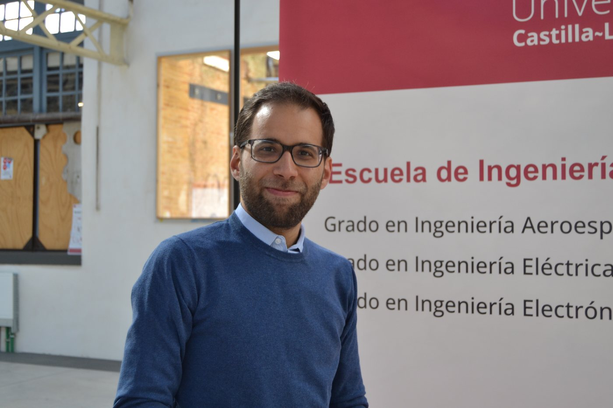
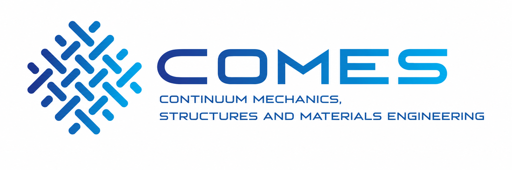

```{=html}
<div class="profile-layout">
  <div class="profile-photo"></div>
  <div class="profile-copy">
    <h2>Current position</h2>
    <p><strong>Profesor Titular de Universidad</strong> (since March 2025) in the area of Continuum Mechanics and Theory of Structures, Department of Applied Mechanics and Project Engineering, University of Castilla-La Mancha.</p>
    <p>I teach at the <strong>School of Industrial and Aerospace Engineering of Toledo (EIIA-To)</strong> and conduct research within the <strong>COMES</strong> group.</p>
    <div class="profile-links">
      <a href="https://orcid.org/0000-0002-6539-7980">ORCID</a>
      <a href="https://www.scopus.com/authid/detail.uri?authorId=58055226700">Scopus</a>
      <a href="https://www.webofscience.com/wos/author/record/Q-4783-2017">Web of Science</a>
      <a href="https://www.linkedin.com/in/sergio-horta-munoz/">LinkedIn</a>
    </div>
  </div>
</div>
```

## Education

```{=html}
<div class="timeline-item"><strong>2020 — PhD, Applied Sciences and Technologies in Industrial Engineering, UCLM</strong><br>International Mention. Thesis: <em>Complexity of the structural response of fibre reinforced polymer matrix composites</em>.</div>
```
```{=html}
<div class="timeline-item"><strong>2017 — Master's Degree in Industrial Engineering, UCLM</strong><br>Extraordinary end-of-study award.</div>
```
```{=html}
<div class="timeline-item"><strong>2015 — Bachelor's Degree in Mechanical Engineering, UCLM</strong></div>
```

## Research profile

My work focuses on continuum mechanics and the experimental, analytical and numerical characterisation of fibre-reinforced polymer composites. Major themes include biaxial and multiaxial testing, non-linear response of angle-ply laminates, pseudo-ductility, shear characterisation, damage modelling and finite-element simulation.

## Selected recognition and transfer

- Utility model **ES1295252_U**, anti-buckling device for biaxial testing with cruciform specimens.
- Contribution to the working group associated with **UNE 0074:2023**.
- **2026:** *Modelling Outstanding Reviewer Award*.
- **2025:** recognition associated with the utility model by the Spanish Patent and Trademark Office.
- **2018:** AIRBUS award for Master's Final Project.
- **2017:** Extraordinary end-of-study award, Master's Degree in Industrial Engineering.
- **2016:** COGITI award for Final Degree Project.

## Academic profiles

```{=html}
<div class="profile-links profile-links-large">
  <a href="https://orcid.org/0000-0002-6539-7980"><strong>ORCID</strong><span>0000-0002-6539-7980</span></a>
  <a href="https://www.scopus.com/authid/detail.uri?authorId=58055226700"><strong>Scopus</strong><span>Author profile</span></a>
  <a href="https://www.webofscience.com/wos/author/record/Q-4783-2017"><strong>Web of Science</strong><span>Q-4783-2017</span></a>
  <a href="https://www.linkedin.com/in/sergio-horta-munoz/"><strong>LinkedIn</strong><span>Professional profile</span></a>
</div>
```

## Institutional links


```{=html}
<div class="affiliation-strip five-logos">
  <a class="affiliation-logo" href="https://www.uclm.es/"></a>
  <a class="affiliation-logo" href="https://www.uclm.es/toledo/eiia"></a>
  <a class="affiliation-logo" href="https://uclm-inaia.github.io/"></a>
  <a class="affiliation-logo" href="https://www.uclm.es/grupos/COMES"></a>
  <a class="affiliation-logo trames-logo" href="https://www.uclm.es/grupos/comes/transferencia/utctrames"></a>
</div>
```

