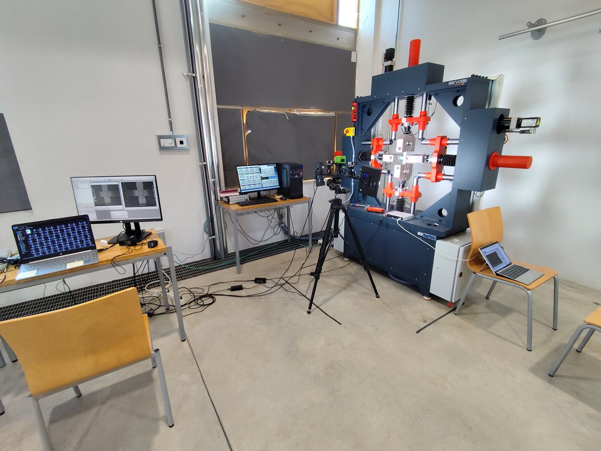
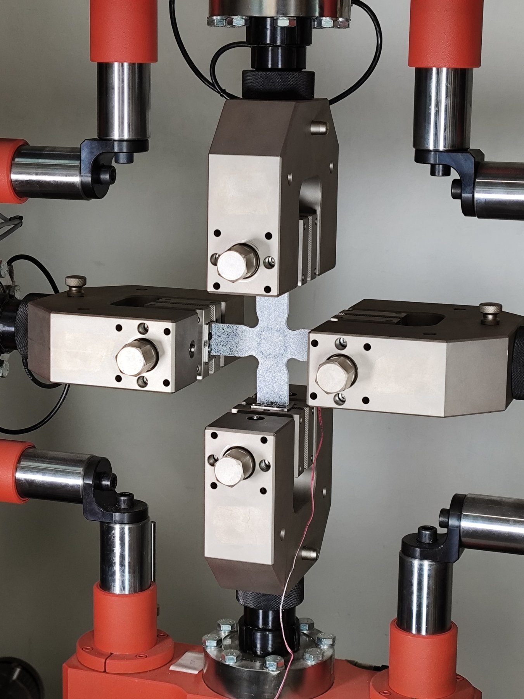
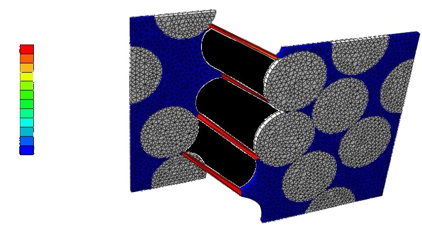
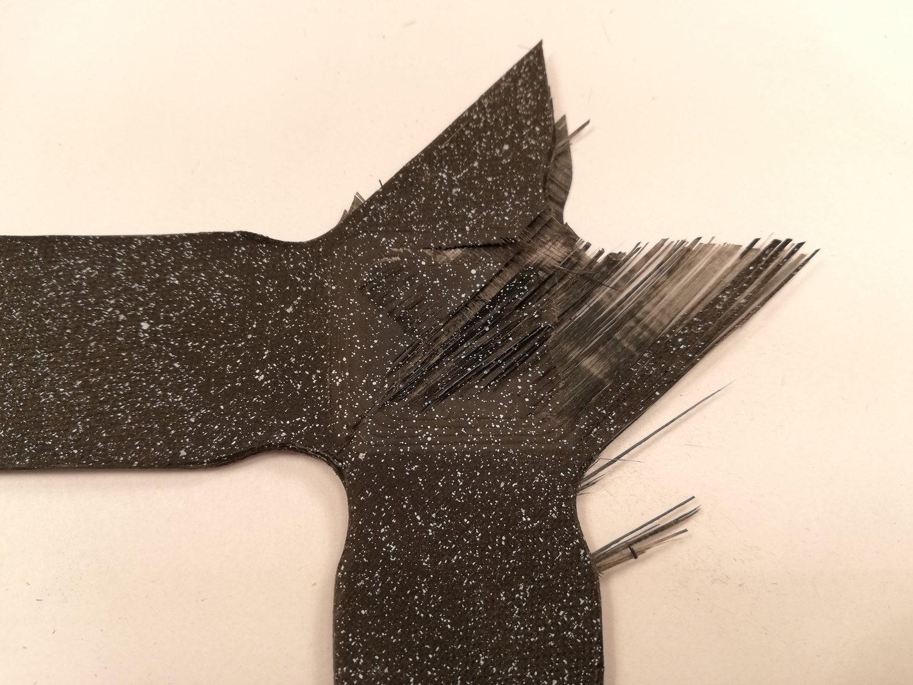
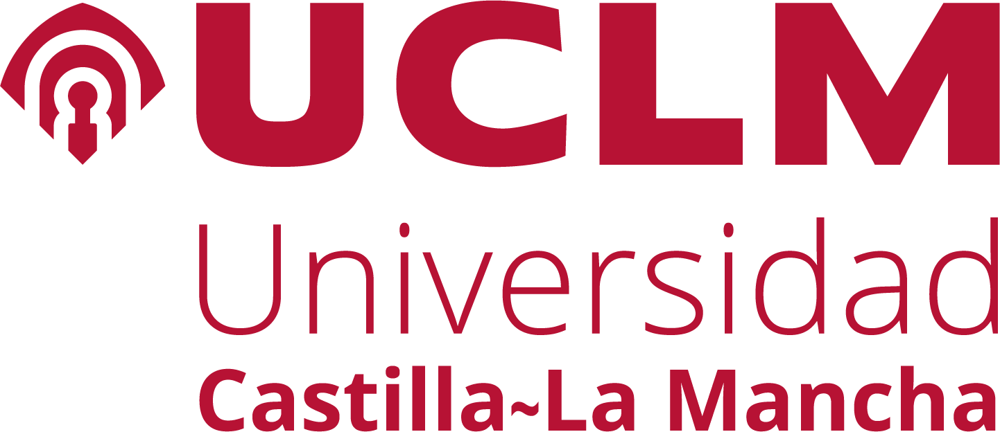
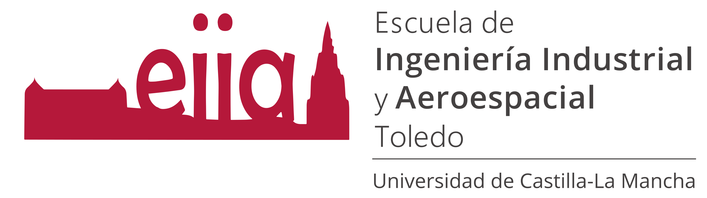

```{=html}
<div class="hero-panel">
  <div class="hero-copy">
    <div class="hero-kicker">Mecánica de medios continuos · Materiales compuestos · Mecánica experimental</div>
    <h1>Sergio Horta Muñoz</h1>
    <div class="hero-subtitle">
      Profesor Titular de Universidad en la Universidad de Castilla-La Mancha. Mi trabajo combina ensayos mecánicos avanzados y modelado mediante elementos finitos para estudiar la respuesta no lineal, el daño y el fallo de materiales compuestos ante estados de carga complejos.
    </div>
    <div class="button-row">
      <a class="shm-button" href="research.html">Investigación</a>
      <a class="shm-button-outline" href="publications.html">Publicaciones</a>
      <a class="shm-button-outline" href="projects.html">Proyectos</a>
    </div>
  </div>
  <div class="hero-image">
    
    <div class="photo-caption">Laboratorio de ensayo biaxial en el INAIA.</div>
  </div>
</div>
```

## Líneas principales

```{=html}
<div class="section-intro">
Mi investigación abarca el flujo experimental–numérico completo: diseño e instrumentación de ensayos, caracterización multiaxial y a cortadura, medidas de campo completo y modelos de elementos finitos desde la microescala hasta el laminado.
</div>
```

```{=html}
<div class="card-grid home-focus">
  <div class="info-card"><h3>Ensayos multiaxiales</h3><p>Caracterización biaxial y multiaxial, probetas cruciformes, cargas combinadas de tracción/compresión, diseño de ensayos y estabilidad.</p></div>
  <div class="info-card"><h3>Mecánica de materiales compuestos</h3><p>Respuesta no lineal y pseudo-dúctil de laminados CFRP angle-ply, comportamiento gobernado por cortadura y mecanismos de fallo.</p></div>
  <div class="info-card"><h3>Modelado numérico</h3><p>Elementos finitos, principalmente con Abaqus, incluyendo micromecánica, iniciación de daño, fallo progresivo y ensayo virtual.</p></div>
</div>
```

## Del ensayo a la simulación

```{=html}
<div class="research-image-grid">
  <div class="research-image-card"><div class="media-card-copy"><strong>Mecánica experimental</strong><br>Carga biaxial, útiles específicos y medidas de campo completo.</div></div>
  <div class="research-image-card"><div class="media-card-copy"><strong>Modelado micromecánico</strong><br>Iniciación de daño y propagación de grietas a escala fibra–matriz.</div></div>
  <div class="research-image-card"><div class="media-card-copy"><strong>Daño y fallo</strong><br>Interpretación experimental de patrones de fallo complejos en laminados CFRP.</div></div>
</div>
```

## Docencia

Mi actividad docente actual se centra en **Resistencia de Materiales** y **Mecánica del Sólido Deformable**, principalmente en el Grado en Ingeniería Aeroespacial de la Escuela de Ingeniería Industrial y Aeroespacial de Toledo.

[Docencia e innovación docente →](teaching.html)

## Últimas novedades

[Novedades y actividades →](news.html)

## Afiliaciones


```{=html}
<div class="affiliation-strip five-logos">
  <a class="affiliation-logo" href="https://www.uclm.es/"></a>
  <a class="affiliation-logo" href="https://www.uclm.es/toledo/eiia"></a>
  <a class="affiliation-logo" href="https://uclm-inaia.github.io/"></a>
  <a class="affiliation-logo" href="https://www.uclm.es/grupos/COMES"></a>
  <a class="affiliation-logo trames-logo" href="https://www.uclm.es/grupos/comes/transferencia/utctrames"></a>
</div>
```
