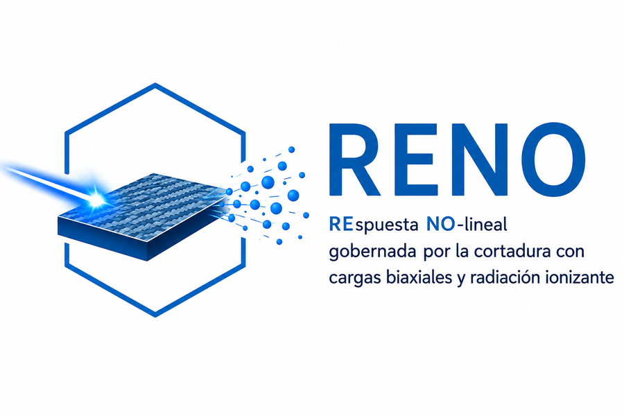
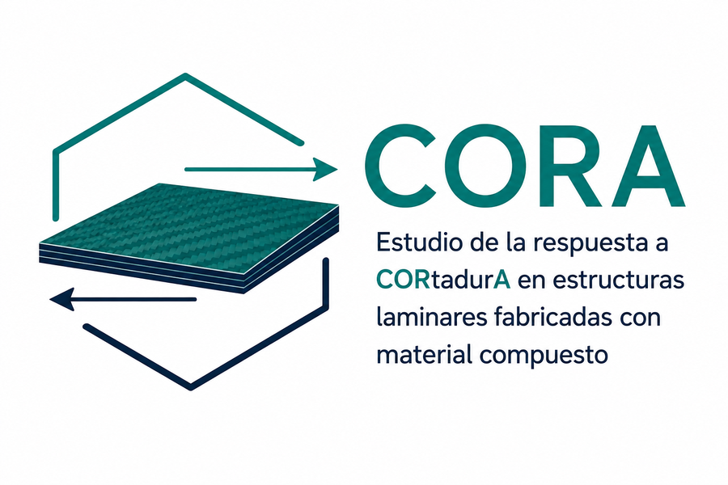
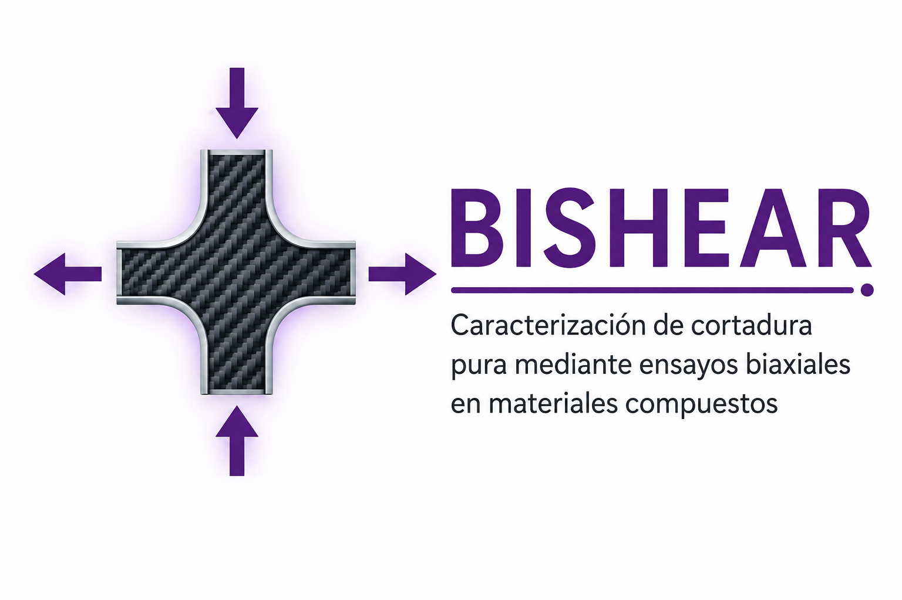

Las webs de proyecto recogen con más detalle objetivos, paquetes de trabajo, publicaciones, difusión e impacto, mientras que esta web personal funciona como puerta de entrada resumida.

```{=html}
<section class="project-showcase" id="reno"><div class="project-media"></div><div class="project-body"><div class="project-code">PID2022-137387OB-I00 · 2023–2026</div><h2>RENO</h2><h3>REspuesta NO-lineal gobernada por la cortadura en materiales compuestos considerando cargas biaxiales y el efecto de radiación ionizante</h3><p>Ensayos biaxiales, respuesta no lineal a cortadura, efectos de radiación y modelado micromecánico del daño.</p><p><a class="shm-button" href="https://comes-uclm.github.io/reno/es/">Web del proyecto RENO →</a></p></div></section>
```
```{=html}
<section class="project-showcase reverse" id="cora"><div class="project-media"></div><div class="project-body"><div class="project-code">SBPLY/23/180225/000114 · 2024–2027</div><h2>CORA</h2><h3>Estudio de la respuesta a CORtadurA en estructuras laminares fabricadas con material compuesto</h3><p>Caracterización a cortadura pura, comparación con normas, desarrollo de utillaje biaxial y normalización.</p><p><a class="shm-button" href="https://comes-uclm.github.io/cora/es/">Web del proyecto CORA →</a></p></div></section>
```
<!-- CARLA HIDDEN UNTIL FUNDING DECISION. To activate, remove this comment and restore the corresponding block from data/CARLA_HIDDEN_PROJECT_BLOCKS.md. -->
```{=html}
<section class="project-showcase reverse" id="bishear"><div class="project-media"></div><div class="project-body"><div class="project-code">PDC2021-121154-I00 · 2021–2024</div><h2>BISHEAR</h2><h3>Hacia la normalización del ensayo biaxial tracción–compresión para propiedades de cortadura</h3><p>Proyecto Prueba de Concepto que dio lugar a la UNE 0074:2023.</p><p><a class="shm-button-outline" href="https://comes-uclm.github.io/">Web BISHEAR →</a></p></div></section>
```
