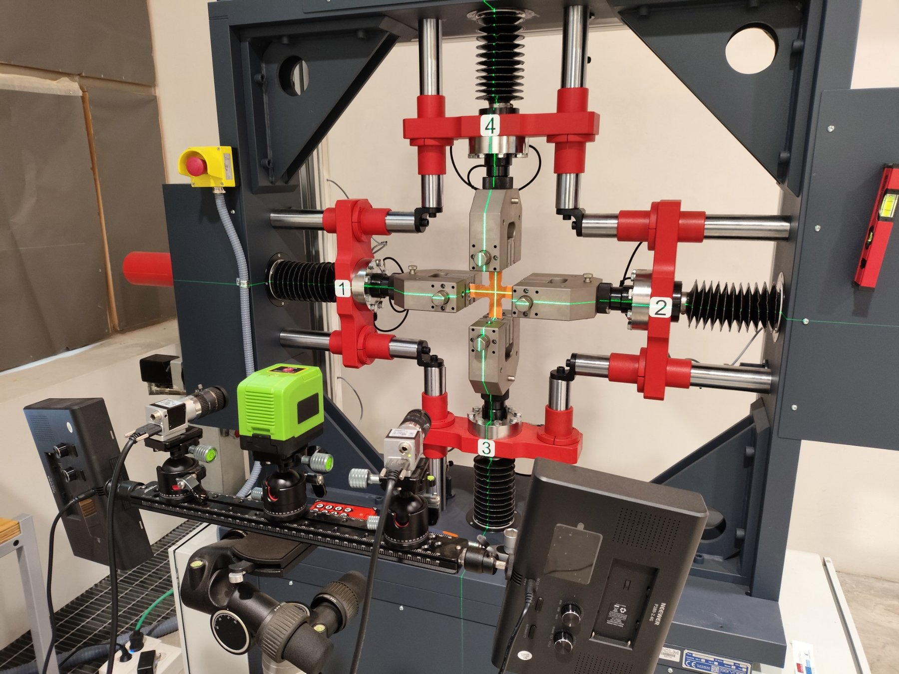
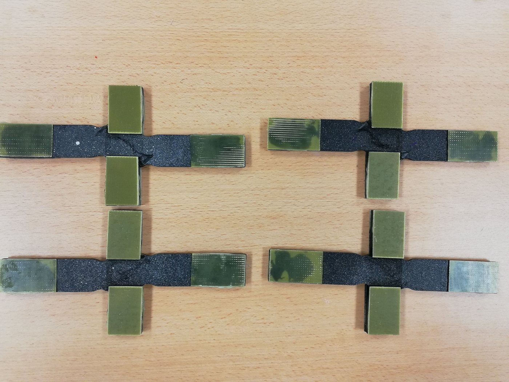
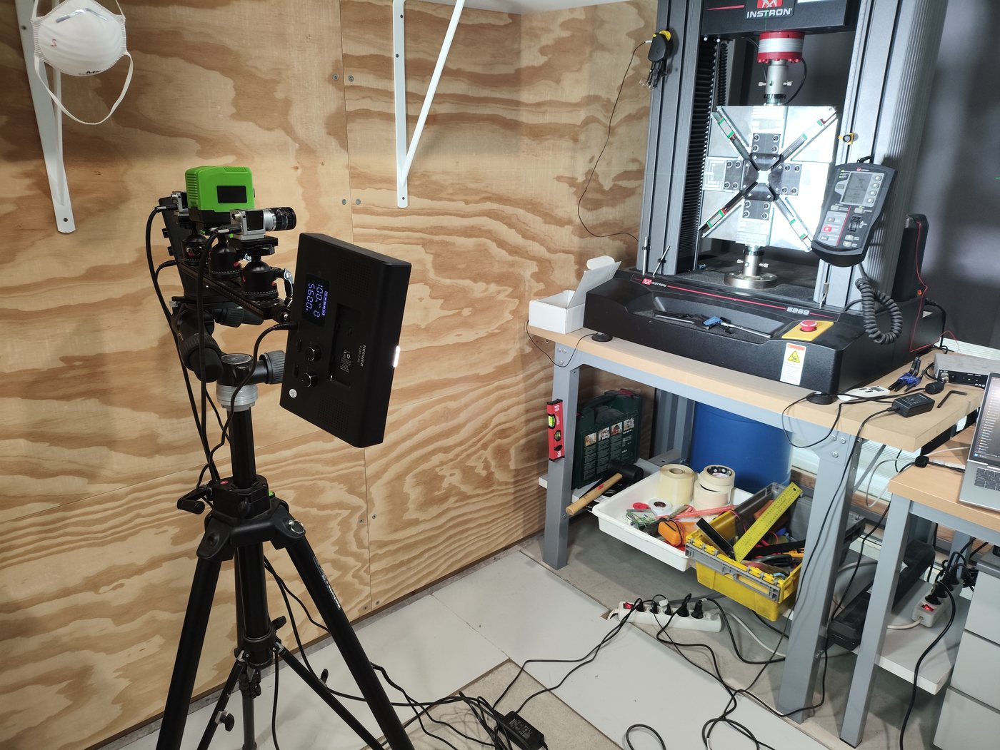
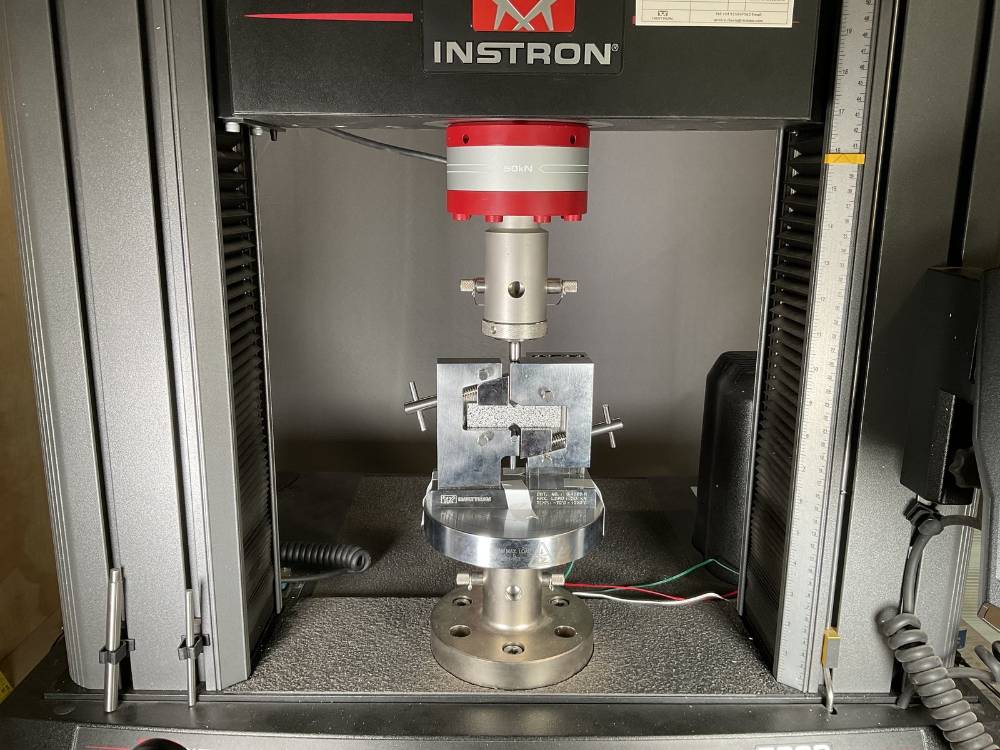
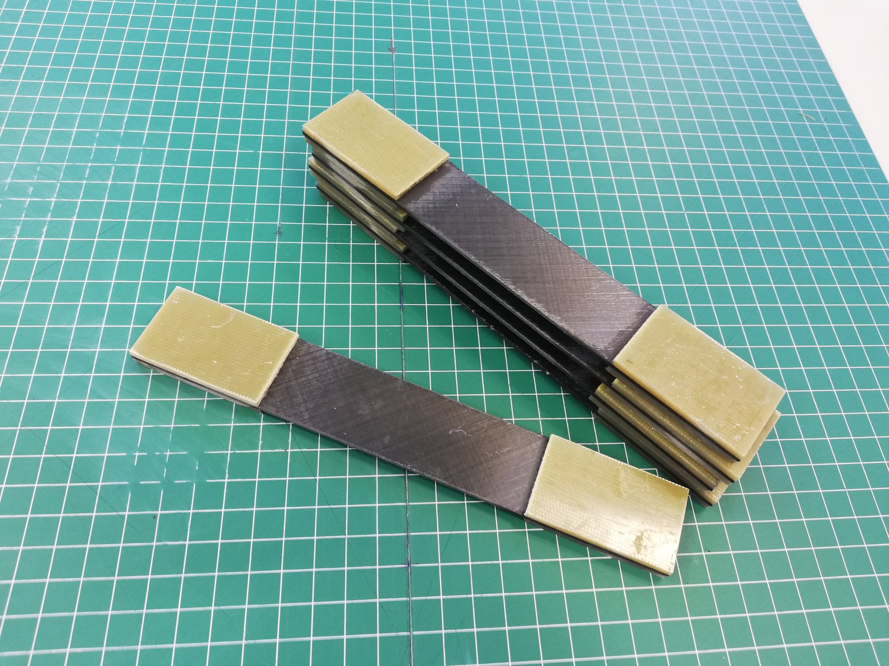

Mi investigación se desarrolla dentro del grupo **COMES — Mecánica de los Medios Continuos, Ingeniería de Estructuras y de Materiales** de la Universidad de Castilla-La Mancha. El hilo conductor es la respuesta mecánica de materiales y estructuras ante estados de carga complejos, combinando experimentación avanzada con modelado analítico y numérico.

[Grupo de investigación COMES](https://www.uclm.es/grupos/COMES)

```{=html}
<div class="research-matrix">
  <article class="research-block"><div class="research-block-copy"><div class="eyebrow">Mecánica experimental</div><h3>Ensayos multiaxiales</h3><p>Diseño e interpretación de ensayos biaxiales y multiaxiales, especialmente con probetas cruciformes. Se estudian estados tracción–tracción, tracción–compresión y dominados por compresión, junto con la estabilidad y la medida de campos de deformación.</p><div class="method-line">DIC · extensometría · probetas cruciformes · inestabilidades</div></div></article>
  <article class="research-block"><div class="research-block-copy"><div class="eyebrow">Materiales compuestos</div><h3>Respuesta no lineal de laminados CFRP</h3><p>Estudio de laminados angle-ply simétricos cuya respuesta está fuertemente gobernada por la cortadura en el plano, incluyendo pseudo-ductilidad, reorientación de fibras, acumulación de daño y evolución de la rigidez.</p><div class="method-line">CFRP angle-ply · pseudo-ductilidad · no linealidad · fallo</div></div></article>
  <article class="research-block"><div class="research-block-copy"><div class="eyebrow">Mecánica computacional</div><h3>Modelado de daño y fallo</h3><p>Simulación por elementos finitos a distintas escalas, desde modelos representativos fibra–matriz hasta formulaciones de daño a escala de laminado. Se emplea Abaqus para analizar iniciación, degradación de rigidez, propagación de grietas y fallo.</p><div class="method-line">Abaqus · FEM/XFEM · micro/mesoescala · daño progresivo</div></div></article>
  <article class="research-block"><div class="research-block-copy"><div class="eyebrow">Medidas de campo completo</div><h3>Medición e interpretación inversa</h3><p>Integración de Correlación Digital de Imágenes con ensayos mecánicos para obtener campos heterogéneos de deformación, identificar fenómenos locales y apoyar la validación o identificación inversa de modelos.</p><div class="method-line">DIC 2D/3D · campo completo · validación numérica</div></div></article>
</div>
```

## Caracterización a cortadura y normalización

```{=html}
<div class="shear-showcase">
  <div class="shear-main-image"></div>
  <div class="shear-main-copy"><div class="eyebrow">Metodología destacada</div><h3>Ensayo biaxial tracción–compresión · UNE 0074:2023</h3><p>Una línea central es la determinación de propiedades de cortadura en el plano mediante un ensayo biaxial tracción–compresión con probeta cruciforme. La metodología desarrollada en COMES contribuyó a la <strong>UNE 0074:2023</strong> y al proyecto de prueba de concepto BISHEAR.</p><p>El ensayo se compara con métodos convencionales de cortadura para analizar el estado tensión–deformación, la accesibilidad experimental y su utilidad en la caracterización avanzada de materiales compuestos.</p></div>
</div>
```

```{=html}
<div class="mini-method-grid standards-grid">
  <div class="mini-method-card">
    
    <h4>Iosipescu · ASTM D5379/D5379M</h4>
    <p>Método de viga entallada en V empleado para determinar propiedades de cortadura en el plano de materiales compuestos.</p>
  </div>
  <div class="mini-method-card">
    
    <h4>V-notched rail shear · ASTM D7078/D7078M</h4>
    <p>Método de cortadura mediante raíles empleado como referencia para comparar la respuesta no lineal y la resistencia a cortadura.</p>
  </div>
  <div class="mini-method-card">
    
    <h4>Tracción ±45° · ASTM D3518/D3518M</h4>
    <p>Caracterización a tracción de un laminado ±45°, ampliamente utilizada para obtener la evolución tensión–deformación de cortadura en el plano.</p>
  </div>
  <div class="mini-method-card">
    
    <h4>Capacidad biaxial en el INAIA</h4>
    <p>El sistema Servosis de cuatro actuadores amplía el espacio de estados de carga biaxiales y las posibilidades de instrumentación de campo completo.</p>
  </div>
</div>
```

## Capacidades experimentales y numéricas

```{=html}
<div class="card-grid">
  <div class="info-card"><h3>Experimentales</h3><p>Ensayos mecánicos cuasi-estáticos, carga biaxial, DIC, extensometría, probetas de material compuesto y diseño de ensayos estructurales.</p></div>
  <div class="info-card"><h3>Numéricas</h3><p>Abaqus/FEA, mecánica no lineal, modelos de daño, pandeo y estabilidad, simulaciones micro/mesoescala.</p></div>
  <div class="info-card"><h3>Materiales</h3><p>Laminados CFRP, sistemas poliméricos, nanocompuestos, estructuras ligeras y materiales seleccionados obtenidos por fabricación aditiva.</p></div>
</div>
```

## Colaboración

La investigación doctoral incluyó una estancia de tres meses en **Ghent University** en 2019 centrada en modelado micro y mesomecánico de daño en laminados angle-ply ante cargas uniaxiales y biaxiales.

Para propuestas de colaboración relacionadas con ensayo de materiales compuestos, modelado numérico o mecánica multiaxial, consulta la [página de contacto](contact.html).
