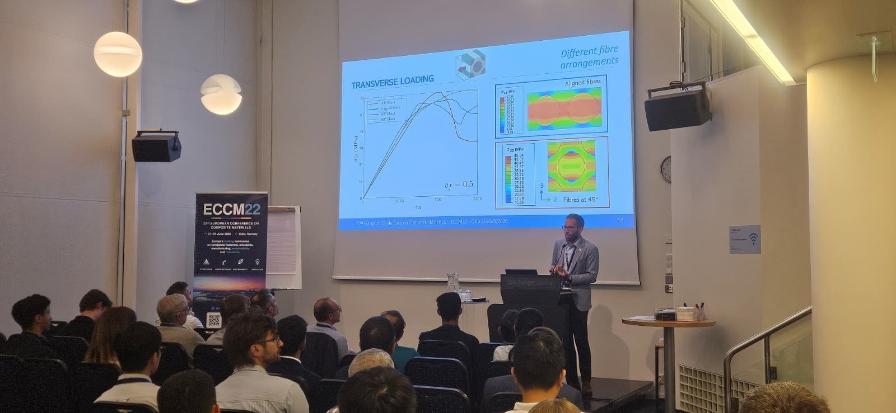

Mi actividad docente principal se desarrolla en la **Escuela de Ingeniería Industrial y Aeroespacial de Toledo (EIIA-To), Universidad de Castilla-La Mancha**.

```{=html}
<figure class="wide-photo teaching-photo">
  
  <figcaption>La comunicación técnica y la divulgación complementan la actividad docente y la supervisión de trabajos académicos.</figcaption>
</figure>
```

## Resistencia de Materiales

Asignatura de segundo curso del Grado en Ingeniería Aeroespacial y, cuando corresponde, de los Grados en Ingeniería Eléctrica e Ingeniería Electrónica Industrial y Automática.

Los contenidos incluyen tensiones y deformaciones, esfuerzo axil, torsión, flexión, tensiones tangenciales, deformación de vigas y análisis estructural básico.

## Mecánica del Sólido Deformable

Asignatura de segundo curso del Grado en Ingeniería Aeroespacial, centrada en conceptos de mecánica de medios continuos y sólidos deformables con componentes analíticas, experimentales y numéricas.

Entre los desarrollos docentes actuales se incluye el uso práctico de **Abaqus**, demostraciones experimentales y actividades que conectan los modelos teóricos con la respuesta estructural medida.

## Innovación docente

Proyectos seleccionados:

- **PÍXEL — PÍldoras eXperimentales para la Enseñanza de ingeniería en el auLa** (2025–2027), proyecto de innovación docente UCLM.
- **FORMATING — Fortaleciendo las competencias en métodos matemáticos mediante software MATLAB en Ingeniería** (2023–2025), IP.

## Trabajos Fin de Grado y Máster

La dirección y codirección se concentra principalmente en cuatro líneas recurrentes:

```{=html}
<div class="card-grid supervision-lines">
  <div class="info-card"><h3>Materiales compuestos</h3><p>Fabricación, caracterización multiaxial/a cortadura, daño, irradiación y ensayos avanzados de CFRP.</p></div>
  <div class="info-card"><h3>Mecánica numérica</h3><p>Elementos finitos, iniciación y propagación de grietas, micromecánica y modelos de daño.</p></div>
  <div class="info-card"><h3>Estructuras ligeras</h3><p>Estructuras sándwich, optimización estructural y validación experimental.</p></div>
</div>
```

Algunos trabajos dirigidos o codirigidos:

- **Ayman Berrem Khalid (2025):** mejora del diseño y fabricación de un dispositivo para ensayos biaxiales — uno de los TFG codirigidos posteriormente reconocido con un premio.
- **César Cano García (2025):** radiación ionizante en materiales compuestos.
- **Claudia Llario Alegre (2024):** diseño de un dispositivo para ensayos biaxiales tracción–compresión en máquina uniaxial — calificación 10/10 y mención de calidad.
- **Abraham Sánchez Romero (2023):** procesado y caracterización mecánica de estructuras sándwich CFRP–Nomex — TFG codirigido con reconocimiento posterior.
- **Vicente Arévalo Madrid (2022):** modelado micromecánico de materiales compuestos unidireccionales — 10/10, mención de calidad y reconocimiento posterior.
- Otros trabajos abarcan optimización topológica, fabricación aditiva, ensayos de cortadura pura, medida de grietas mediante imagen y diseño de prácticas estructurales.
