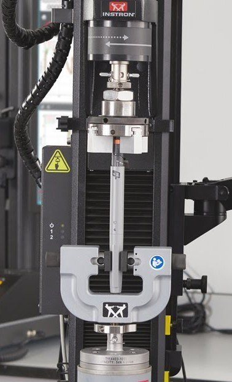

The experimental capabilities available at EIIA-To have expanded with equipment for combined **axial–torsion mechanical testing**. The system complements the multiaxial and full-field experimental methods used in current work on composite materials and other structural materials.

[Read the UCLM news item](https://www.uclm.es/global/promotores/facultades-y-escuelas/toledo/to-industriales/novedades_eiia/2026_07_13_equipamiento_axil_torsion)
