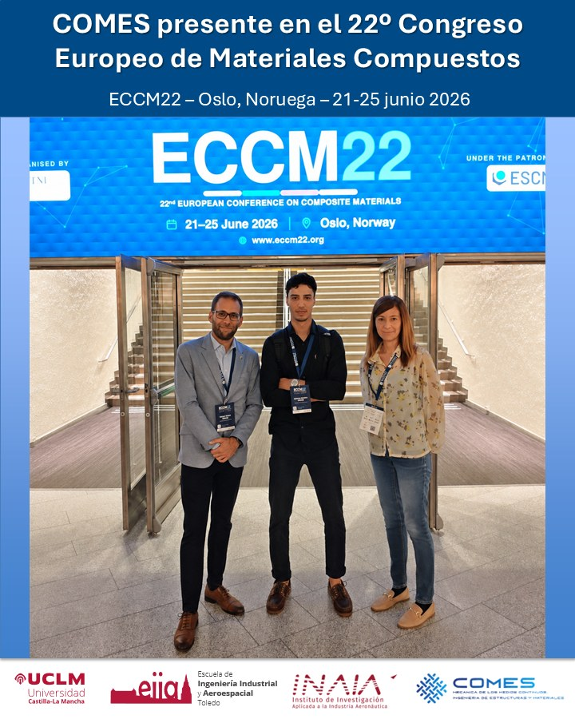

Researchers from COMES participated in **ECCM22**, held in Oslo in June 2026, presenting work on biaxial testing, shear characterisation and micromechanical modelling of damage in composite materials.

One of the contributions focused on the effect of relative fibre geometry on crack initiation and propagation under transverse and shear loading.

[Read the COMES/UCLM news item](https://www.uclm.es/grupos/comes/novedades/eccm22)
