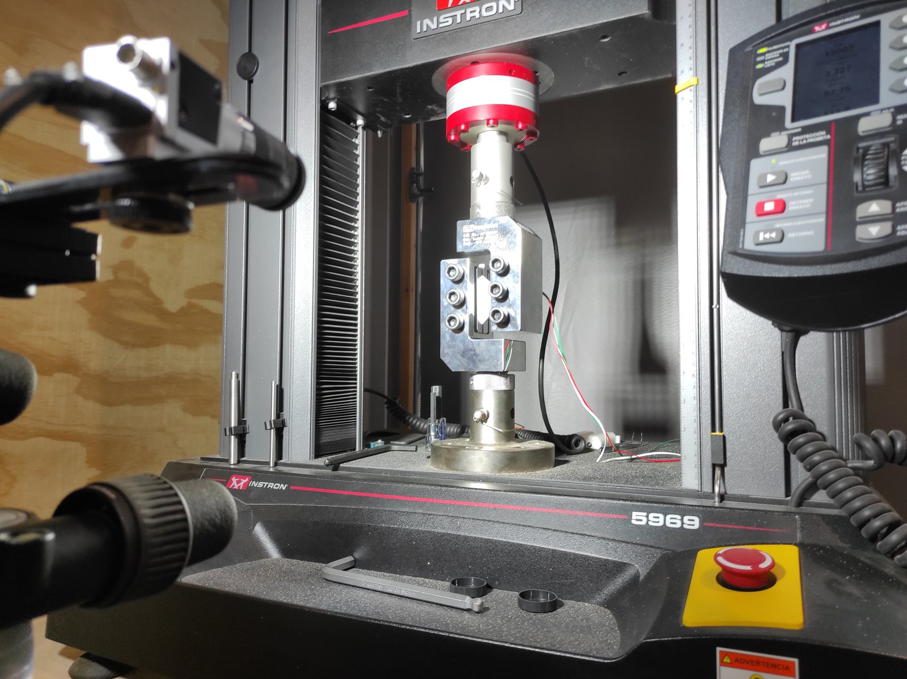
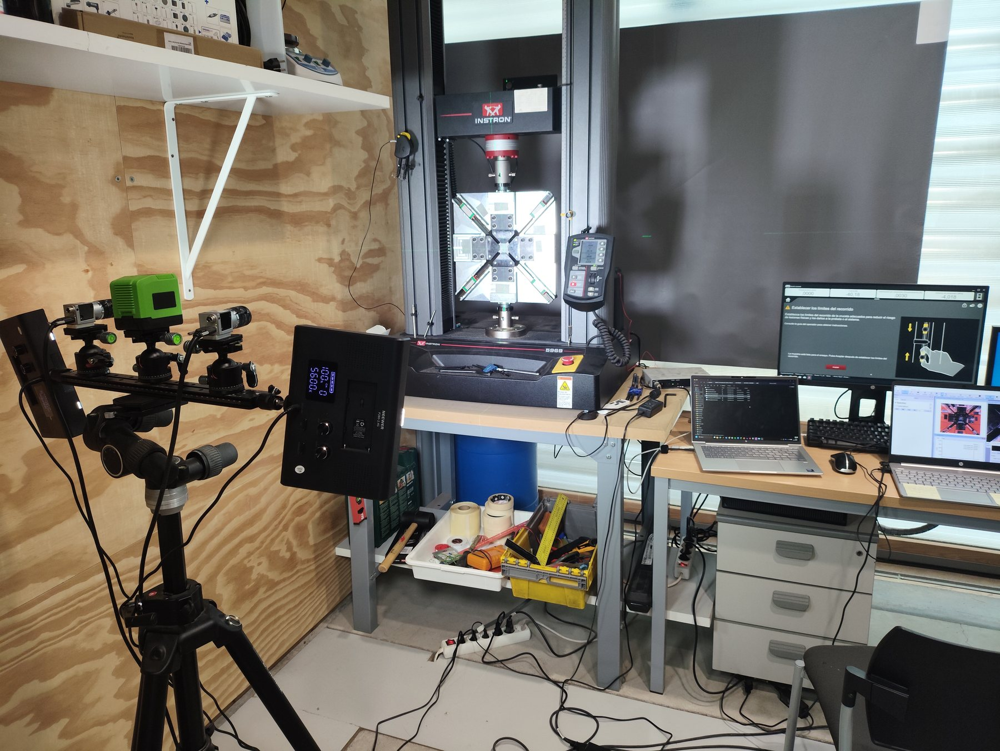

The project websites provide the detailed layer of objectives, work packages, publications, dissemination and impact, while this personal site acts as a concise gateway.

```{=html}
<section class="project-showcase" id="reno"><div class="project-media"></div><div class="project-body"><div class="project-code">PID2022-137387OB-I00 · 2023–2026</div><h2>RENO</h2><h3>Shear-driven NOn-linear REsponse of composites considering biaxial loads and ionizing radiation effects</h3><p>Biaxial testing, non-linear shear response, radiation effects and micromechanical damage modelling.</p><p><a class="shm-button" href="https://comes-uclm.github.io/RENO/">RENO project website →</a></p></div></section>
```
```{=html}
<section class="project-showcase reverse" id="cora"><div class="project-media"></div><div class="project-body"><div class="project-code">SBPLY/23/180225/000114 · 2024–2027</div><h2>CORA</h2><h3>Study of the shear response in laminated structures made of composite material</h3><p>Pure-shear characterization, comparison with standards, biaxial fixture development and standardization.</p><p><a class="shm-button" href="https://comes-uclm.github.io/CORA/">CORA project website →</a></p></div></section>
```
<!-- CARLA HIDDEN UNTIL FUNDING DECISION. To activate, remove this comment and restore the corresponding block from data/CARLA_HIDDEN_PROJECT_BLOCKS.md. -->
```{=html}
<section class="project-showcase reverse" id="bishear"><div class="project-media"></div><div class="project-body"><div class="project-code">PDC2021-121154-I00 · 2021–2024</div><h2>BISHEAR</h2><h3>Towards standardization of the biaxial tension–compression shear test</h3><p>Proof-of-concept project that led to UNE 0074:2023.</p><p><a class="shm-button-outline" href="https://comes-uclm.github.io/BISHEAR/">BISHEAR website →</a></p></div></section>
```
